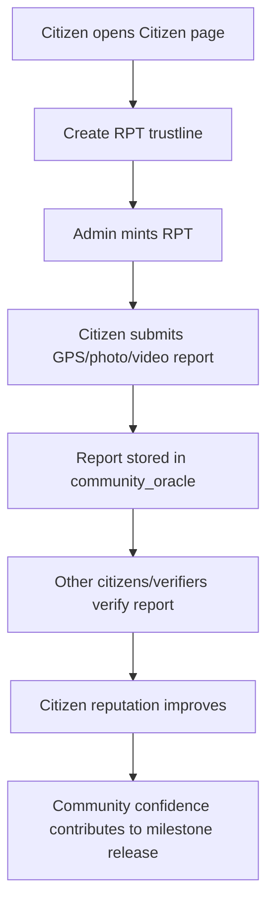

# Chapter 5: Community Verification

Citizens are the real-world eyes of PoPV. They verify whether a project actually exists, whether work is progressing, and whether the public is receiving value.

> **Important:** Citizens must hold **RPT (Report Token)** before submitting reports. RPT acts as a lightweight reporting credential and anti-spam mechanism.

---

## What You'll Learn

- What RPT is and why it is required
- How to create an RPT trustline
- How to receive RPT from an admin
- How to submit a community report with photo/video evidence
- How to verify other citizens' reports
- How citizen reputation works

---

## Why RPT Exists

PoPV does not want random spam reports. It also does not want a closed system where only government-approved citizens can participate.

RPT solves this by creating a simple rule:

> **Any wallet can report if it holds enough RPT.**

This means participation is open, but still controlled enough to reduce spam and Sybil attacks.

| Item | Value |
|------|-------|
| Token | `RPT` (Report Token) |
| Issuer | `GBDNQETDDXGJ42PTL2ODGTBSNV6BYN5P7T3CF27JCN7KT2QMJOEACMSV` |
| Asset Contract | `CCZCWNF4N7ZAZT4GWEWNW44LIOAEWILB56GUIA6BJZ3BYJKTHTEJFCAQ` |
| Current Minimum | `1` RPT stroop |
| Who mints it | Administrator |
| Who uses it | Citizens submitting reports |

---

## How Citizen Reporting Works



---

## Report Types

| Report Type | Use Case |
|------------|----------|
| `GpsPhoto` | GPS-tagged construction photo |
| `GpsVideo` | GPS-tagged construction video |
| `FloodReport` | Flooding/drainage condition report |
| `CompletionVerification` | Confirms milestone appears completed |
| `QualityReport` | Notes work quality or defects |
| `DamageReport` | Reports damage or unsafe conditions |
| `UsageReport` | Confirms citizens are using completed infrastructure |

---

## PVO ID and Milestone ID

When submitting a report, citizens must choose:

- **PVO ID** — the project number
- **Milestone ID** — the specific work phase inside that project

You can find these in the **Public Transparency Portal**:

1. Open the homepage
2. Find the project card
3. The card shows `#1`, `#2`, etc. — this is the **PVO ID**
4. Click the project card to see details and milestones
5. Use the milestone number as the **Milestone ID**

For the current demo:

| Field | Value |
|-------|-------|
| PVO ID | `1` |
| Project | Road Paving Project |
| Milestone ID | `2` |
| Milestone | Site Preparation |

---

# Exercises

## Exercise 5.1: Check the RPT Token

Check the RPT token contract:

```bash
stellar contract invoke --source alice --network testnet --send=yes \
  --id CCZCWNF4N7ZAZT4GWEWNW44LIOAEWILB56GUIA6BJZ3BYJKTHTEJFCAQ \
  -- symbol
```

Expected output:

```text
"RPT"
```

---

## Exercise 5.2: Create an RPT Trustline from the Website

1. Open the web app
2. Connect your citizen wallet with Freighter
3. Go to **Citizen** dashboard
4. In the RPT Token card, click **Create RPT Trustline**
5. Approve the Freighter transaction

After this, the wallet can receive RPT.

!!! note
    A trustline must be signed by the receiving wallet. Admin cannot create a trustline for another wallet unless a sponsorship transaction is built.

---

## Exercise 5.3: Create an RPT Trustline from CLI

If you control the citizen wallet in Stellar CLI:

```bash
stellar contract invoke --source citizen --network testnet --send=yes \
  --id CCZCWNF4N7ZAZT4GWEWNW44LIOAEWILB56GUIA6BJZ3BYJKTHTEJFCAQ \
  -- trust --addr GCLKPYQALOM6WKX3LSJ3OA2STGPZIOZY4B6NUDPWJHTFRSMBLJEJE4ES
```

Expected output:

```text
Transaction submitted successfully
```

---

## Exercise 5.4: Admin Mints RPT to a Citizen

After the trustline exists, admin mints RPT:

```bash
stellar contract invoke --source alice --network testnet --send=yes \
  --id CCZCWNF4N7ZAZT4GWEWNW44LIOAEWILB56GUIA6BJZ3BYJKTHTEJFCAQ \
  -- mint \
  --to GCLKPYQALOM6WKX3LSJ3OA2STGPZIOZY4B6NUDPWJHTFRSMBLJEJE4ES \
  --amount 100
```

Expected result: citizen receives `100` RPT.

---

## Exercise 5.5: Check Citizen RPT Balance

```bash
stellar contract invoke --source alice --network testnet --send=yes \
  --id CCZCWNF4N7ZAZT4GWEWNW44LIOAEWILB56GUIA6BJZ3BYJKTHTEJFCAQ \
  -- balance --id GCLKPYQALOM6WKX3LSJ3OA2STGPZIOZY4B6NUDPWJHTFRSMBLJEJE4ES
```

Expected output:

```text
"100"
```

If you see:

```text
trustline entry is missing for account
```

then the citizen has not created the trustline yet.

---

## Exercise 5.6: Submit a Community Report from the Website

1. Connect the citizen wallet
2. Go to **Citizen → Report**
3. Use:

| Field | Value |
|-------|-------|
| PVO ID | `1` |
| Milestone ID | `2` |
| Report Type | `GpsPhoto` |
| Photo/Video | Attach a file or paste IPFS hash |
| GPS | Click **Use my current location** or enter manually |

4. Click **Submit Report**
5. Approve in Freighter

Expected result: report is submitted on-chain.

---

## Exercise 5.7: Submit a Community Report from CLI

```bash
stellar contract invoke --source citizen --network testnet --send=yes \
  --id CDTZOXPFVGN7SFRMANOJ4C3KN6PHJARPMDLN7ZTLLXJAWUCU4YPGK7RS \
  -- submit_report \
  --citizen citizen \
  --pvo-id 1 \
  --milestone-id 2 \
  --report-type GpsPhoto \
  --data-hash '"ipfs://QmExamplePhotoHash"' \
  --gps-lat 14599512 \
  --gps-lon 120984220
```

Expected output: a report ID.

---

## Exercise 5.8: Verify Another Citizen's Report

A citizen should not verify their own report. The UI hides verification buttons for your own reports and shows them only on reports submitted by other citizens.

To verify a report from CLI:

```bash
stellar contract invoke --source alice --network testnet --send=yes \
  --id CDTZOXPFVGN7SFRMANOJ4C3KN6PHJARPMDLN7ZTLLXJAWUCU4YPGK7RS \
  -- verify_report \
  --verifier alice \
  --report-id 1 \
  --verifier-weight 30
```

Verification weights:

| Weight | Meaning |
|--------|---------|
| `10` | Low confidence / weak evidence |
| `30` | Normal verification |
| `60` | Strong verification |

Expected result: report is marked verified and the submitter's reputation improves.

---

## Exercise 5.9: Check Citizen Reputation

```bash
stellar contract invoke --source alice --network testnet \
  --id CDTZOXPFVGN7SFRMANOJ4C3KN6PHJARPMDLN7ZTLLXJAWUCU4YPGK7RS \
  -- get_citizen_reputation \
  --citizen GCLKPYQALOM6WKX3LSJ3OA2STGPZIOZY4B6NUDPWJHTFRSMBLJEJE4ES
```

Expected fields:

```text
total_reports
verified_reports
confidence_rating
```

---

## Exercise 5.10: What Happens if a Citizen Has No RPT?

Try submitting with a wallet that has no RPT trustline or no balance.

Expected behavior:

- The contract rejects the report
- The website shows an error
- The Citizen dashboard shows RPT setup needed

This protects the system from spam reports.

---

## Summary

Community verification is not just a comment box. It is a token-gated, GPS-enabled, on-chain reporting mechanism where citizens contribute evidence to public infrastructure accountability.

RPT does **not** represent money. It is a lightweight reporting credential used to prove that the reporter is allowed to participate in community verification.
